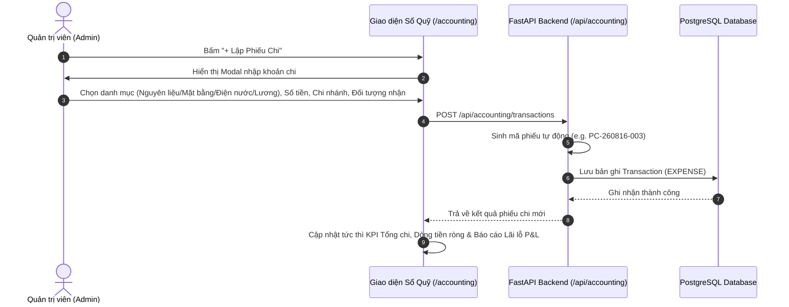

# TÀI LIỆU NGHIỆP VỤ (BA): 10 - SỔ QUỸ THU CHI & KẾ TOÁN QUẢN TRỊ (CASH FLOW & BASIC ACCOUNTING)

## 1. TỔNG QUAN NGHIỆP VỤ & BỐI CẢNH (BUSINESS CONTEXT)

Để đảm bảo tiệm bánh kiểm soát chặt chẽ dòng tiền thực tế, ngăn ngừa thất thoát và nắm bắt chính xác hiệu quả sinh lời thực tế của từng chi nhánh, phân hệ **Sổ Quỹ Thu Chi & Kế Toán Quản Trị** được xây dựng tinh gọn, bám sát nghiệp vụ F&B thực tế.

**Mục tiêu của Module Kế toán Quản trị:**
1. **Quản lý Dòng tiền Thu - Chi (Cash Flow Management):** Ghi nhận mọi giao dịch phát sinh tiền vào (Doanh thu POS, thu thanh lý bao bì, thu khác) và tiền ra (Nhập bơ sữa bột mì, tiền mặt bằng, tiền điện nướng bánh, chi lương).
2. **Lập Phiếu Thu / Phiếu Chi Chuẩn Mực:** Cấp mã phiếu tự động (`PT-yyMMdd-xxx`, `PC-yyMMdd-xxx`), lưu vết người nộp/nhận, hình thức (Tiền mặt / Chuyển khoản QR), chi nhánh phát sinh và chứng từ/ghi chú đính kèm.
3. **Phân tích Báo Cáo Lãi Lỗ P&L Rút Gọn (Profit & Loss Statement):**
   - **Doanh thu thuần (Gross Revenue):** Tổng doanh số bán lẻ POS và thu dịch vụ.
   - **Giá vốn hàng bán (COGS):** Chi phí nguyên vật liệu bột mì, bơ Pháp, sữa tươi, bao bì hộp bánh.
   - **Lợi nhuận gộp (Gross Profit & Margin %):** $\text{Doanh thu} - \text{COGS}$.
   - **Chi phí vận hành (OPEX):** Tiền thuê mặt bằng theo chi nhánh, tiền điện lò nướng/nước, lương nhân viên.
   - **Lợi nhuận ròng thực tế (Net Profit & Margin %):** $\text{Lợi nhuận gộp} - \text{OPEX}$.
4. **Báo cáo Dòng tiền Theo Từng Chi Nhánh & Toàn Chuỗi:** Giúp Quản trị viên đánh giá chi nhánh nào đang kinh doanh hiệu quả, chi nhánh nào đang chịu chi phí vận hành quá cao.

---

## 2. CÁC TÁC NHÂN & MA TRẬN PHÂN QUYỀN (ACTORS & RBAC)

| Tác nhân (Actor) | Quyền hạn trong Module Kế Toán & Sổ Quỹ |
| :--- | :--- |
| **Quản trị viên (Admin)** | - Toàn quyền truy cập trang `/accounting` - Lập Phiếu Thu tiền mặt / chuyển khoản mới - Lập Phiếu Chi tiền mặt / chuyển khoản cho nhà cung cấp, chủ nhà, nhân sự - Xem và lọc Báo cáo Dòng tiền & Báo cáo Lãi Lỗ P&L theo từng chi nhánh hoặc toàn chuỗi |
| **Thu ngân (Staff)** | - Không có quyền truy cập vào phân hệ `/accounting` - Doanh thu bán hàng tại quầy POS của thu ngân tự động được tổng hợp vào dòng thu của hệ thống |

---

## 3. QUY TRÌNH NGHIỆP VỤ CHI TIẾT (BUSINESS PROCESS FLOW)

### 3.1. Quy trình Lập Phiếu Chi (Payment Voucher Creation)
1. Admin truy cập [`/accounting`](file:///Users/gnuhh/Project/python/fe/app/accounting/page.tsx) và bấm **"- Lập Phiếu Chi"**.
2. Chọn danh mục:
   - *Chi phí Nguyên vật liệu & Nhập hàng (Bột, Bơ, Sữa)*
   - *Chi phí Bao bì & Hộp bánh*
   - *Chi phí Thuê Mặt bằng cơ sở*
   - *Chi phí Điện, Nước & Tiện ích lò nướng*
   - *Chi phí Lương & Phụ cấp nhân sự*
   - *Chi phí Sửa chữa bảo trì thiết bị / Khác*
3. Nhập số tiền chi trả, hình thức (Tiền mặt hoặc Chuyển khoản), chi nhánh phát sinh, người nhận tiền và nội dung giải trình.
4. Bấm **"Tạo Phiếu Chi"** $\rightarrow$ Hệ thống lập tức khấu trừ vào dòng tiền ròng của cơ sở và cập nhật vào báo cáo P&L.

---

## 4. CẤU TRÚC DỮ LIỆU & SCHEMA (DATA DICTIONARY)

### Entity: `Transaction` (`transactions`)

| Trường dữ liệu | Kiểu | Bắt buộc | Mô tả |
| :--- | :--- | :--- | :--- |
| `id` | `VARCHAR(50)` | Có | Khóa chính giao dịch (e.g. `tx-8f12a3`) |
| `code` | `VARCHAR(50)` | Có | Mã chứng từ duy nhất (`PT-260816-001`, `PC-260816-001`) |
| `transaction_type` | `VARCHAR(20)` | Có | `INCOME` (Phiếu thu) / `EXPENSE` (Phiếu chi) |
| `category` | `VARCHAR(100)` | Có | Danh mục khoản mục thu/chi |
| `amount` | `INTEGER` | Có | Số tiền phát sinh (VNĐ) |
| `branch_id` | `VARCHAR(50)` | Không | Khóa ngoại chi nhánh phát sinh (`branches.id`) |
| `payment_method` | `VARCHAR(30)` | Có | `CASH` (Tiền mặt) / `BANK_TRANSFER` (Chuyển khoản QR) |
| `recipient_payer` | `VARCHAR(150)` | Có | Người nộp tiền hoặc người nhận tiền |
| `note` | `TEXT` | Không | Ghi chú / Diễn giải chi tiết khoản tiền |
| `created_by` | `VARCHAR(100)` | Không | Người lập phiếu |
| `created_at` | `TIMESTAMP` | Có | Thời điểm phát sinh giao dịch |
