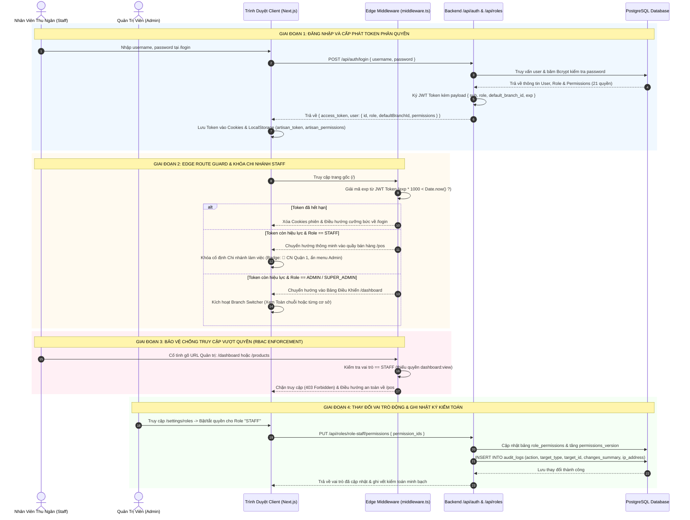
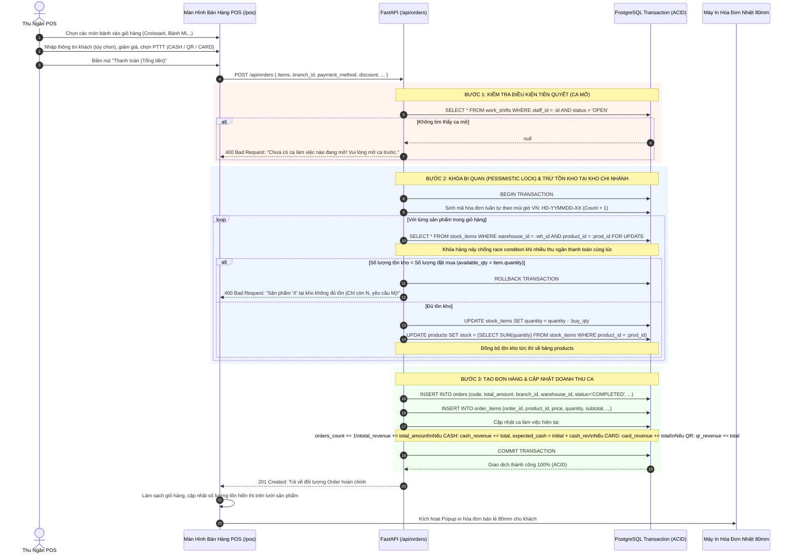
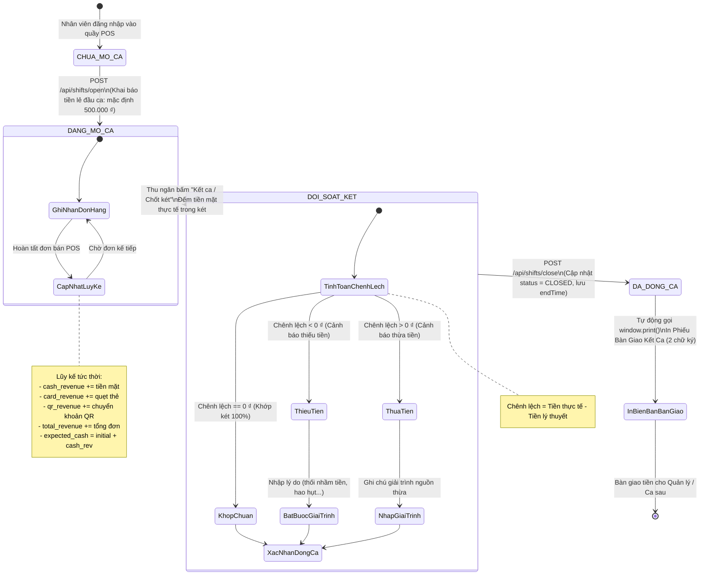
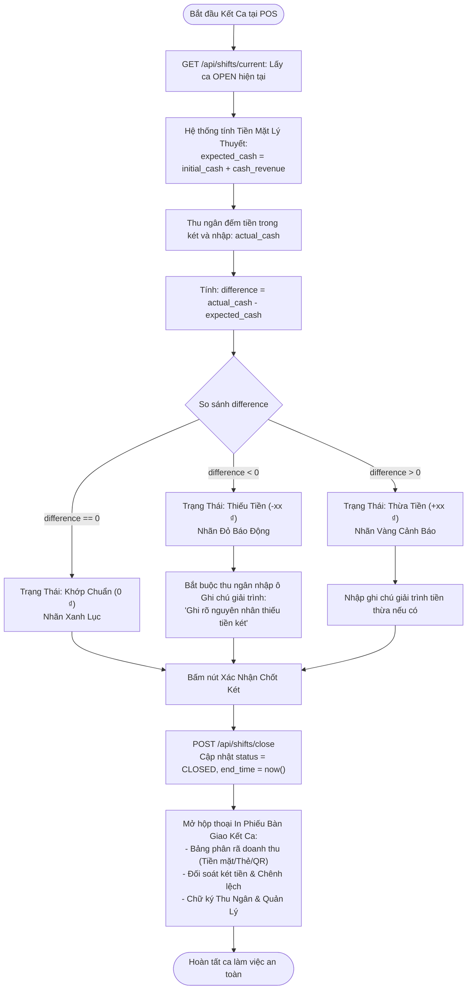
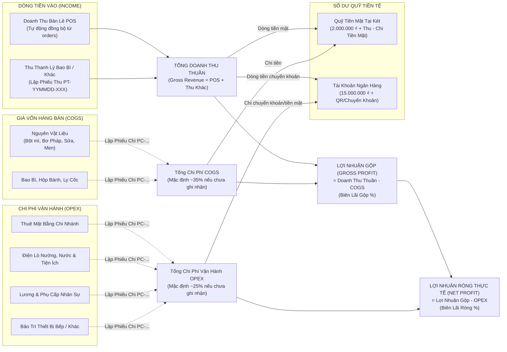
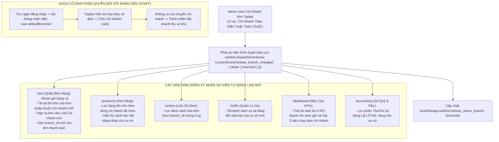
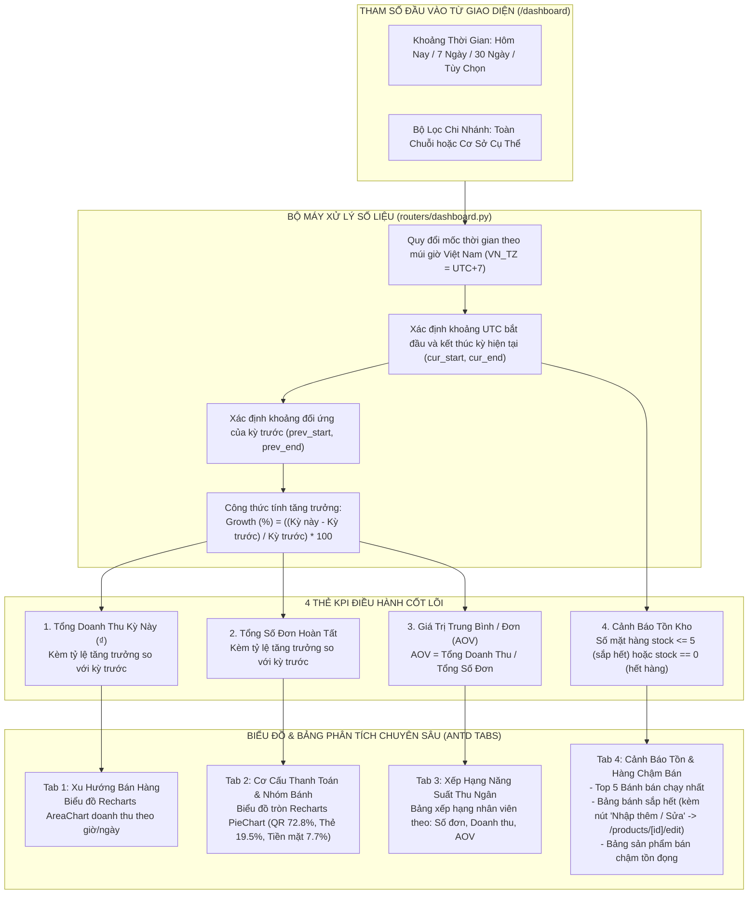
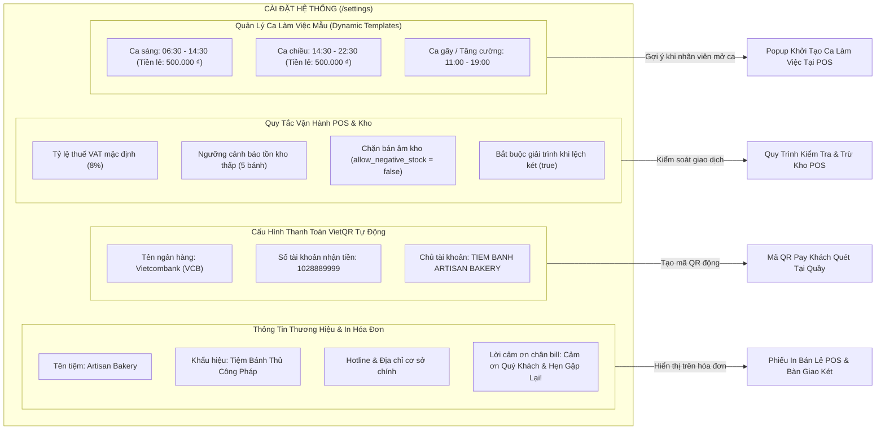

# TỔNG HỢP TOÀN BỘ SƠ ĐỒ NGHIỆP VỤ HỆ THỐNG (ARTISAN BAKERY ERP)

> **Dự án:** Hệ thống Quản lý Đơn hàng & Vận hành Chuỗi Tiệm Bánh (Artisan Bakery Management System)  
> **Backend:** FastAPI, SQLAlchemy 2.0, PostgreSQL 16, PBAC 21 Permissions, Pessimistic Locking (`with_for_update`)  
> **Frontend:** Next.js 16 (App Router), React 19, Ant Design v6, Tailwind CSS, Recharts  
> **Tài liệu chuẩn:** Bao phủ 100% nghiệp vụ theo 10 tài liệu BA và mã nguồn hệ thống.

---

## MỤC LỤC

1. [Sơ Đồ 1: Bản Đồ Kiến Trúc Nghiệp Vụ Tổng Thể](#1-sơ-đồ-1-bản-đồ-kiến-trúc-nghiệp-vụ-tổng-thể-system-business-map)
2. [Sơ Đồ 2: Thực Thể Dữ Liệu Toàn Hệ Thống (ERD)](#2-sơ-đồ-2-thực-thể-dữ-liệu-toàn-hệ-thống-comprehensive-erd)
3. [Sơ Đồ 3: Luồng Xác Thực, Edge Route Guard & PBAC](#3-sơ-đồ-3-luồng-xác-thực-edge-route-guard--phân-quyền-pbac-động)
4. [Sơ Đồ 4: Nghiệp Vụ Bán Hàng POS & Giao Dịch Kho Nguyên Tử](#4-sơ-đồ-4-nghiệp-vụ-bán-hàng-pos--giao-dịch-kho-nguyên-tử-atomic-pos)
5. [Sơ Đồ 5: Vòng Đời Ca Làm Việc & Đối Soát Két Tiền Mặt](#5-sơ-đồ-5-vòng-đời-ca-làm-việc--đối-soát-két-tiền-mặt)
6. [Sơ Đồ 6: Sổ Quỹ Thu Chi & Kế Toán Quản Trị Lãi Lỗ (P&L)](#6-sơ-đồ-6-sổ-quỹ-thu-chi--kế-toán-quản-trị-lãi-lỗ-pl)
7. [Sơ Đồ 7: Cơ Chế Đa Chi Nhánh, Đa Kho & Đồng Bộ Real-time](#7-sơ-đồ-7-cơ-chế-đa-chi-nhánh-đa-kho--đồng-bộ-thời-gian-thực)
8. [Sơ Đồ 8: Bộ Máy Phân Tích & Báo Cáo Điều Hành Dashboard](#8-sơ-đồ-8-bộ-máy-phân-tích--báo-cáo-điều-hành-dashboard)
9. [Sơ Đồ 9: Cài Đặt Hệ Thống, VietQR & Mẫu Ca Làm Việc Động](#9-sơ-đồ-9-cài-đặt-hệ-thống-vietqr--mẫu-ca-làm-việc-động)
10. [Ma Trận 21 Quyền Hạn Nguyên Tử (PBAC) & Ánh Xạ Source Code](#10-ma-trận-21-quyền-hạn-nguyên-tử-pbac--ánh-xạ-file-source-code)

---

## 1. Sơ Đồ 1: Bản Đồ Kiến Trúc Nghiệp Vụ Tổng Thể (System Business Map)

```mermaid
flowchart TD
    %% Định nghĩa các Actor
    subgraph ACTORS ["CÁC TÁC NHÂN HỆ THỐNG"]
        Actor_SuperAdmin["Super Admin - Tổng Quản Trị"]
        Actor_Admin["Admin - Chủ Chuỗi / Quản Lý"]
        Actor_Staff["Staff - Thu Ngân Tại Quầy"]
        Actor_Customer["Khách Hàng Mua Bánh"]
    end

    %% Giao diện người dùng
    subgraph FRONTEND ["FRONTEND WEB (NEXT.JS 16 & ANTD V6)"]
        UI_Login["Trang Đăng Nhập (/login)"]
        UI_Edge["Edge Route Guard (middleware.ts)"]
        UI_Pos["Quầy Bán Hàng POS (/pos)"]
        UI_Shift["Quản Lý Ca & Chốt Két (/shifts)"]
        UI_Products["Quản Lý Sản Phẩm & Kho (/products)"]
        UI_Orders["Lịch Sử Đơn Hàng (/orders)"]
        UI_Accounting["Sổ Quỹ & Kế Toán P&L (/accounting)"]
        UI_Branches["Quản Lý Chi Nhánh & Kho (/branches)"]
        UI_Users["Quản Trị Nhân Sự (/users)"]
        UI_Roles["Phân Quyền Động PBAC (/settings/roles)"]
        UI_Settings["Cài Đặt Hệ Thống & Ca Mẫu (/settings)"]
        UI_Dashboard["Bảng Điều Khiển KPIs (/dashboard)"]
    end

    %% Tầng xử lý nghiệp vụ Backend API
    subgraph BACKEND_API ["FASTAPI BACKEND SERVICES (g09-api-ref)"]
        API_Auth["/api/auth - Xác thực JWT & Me Profile"]
        API_Roles["/api/roles & /permissions - Quản lý 21 Quyền PBAC"]
        API_Shifts["/api/shifts - Vòng đời Ca & Đối soát Két"]
        API_Orders["/api/orders - Checkout POS Atomic & Trừ kho"]
        API_Products["/api/products - Danh mục, Giá & Mức tồn"]
        API_Branches["/api/branches - Chi nhánh & Kho hàng"]
        API_Accounting["/api/accounting - Phiếu Thu/Chi & P&L"]
        API_Dashboard["/api/dashboard - Thống kê KPIs theo Giờ/Ngày/Kỳ"]
        API_Settings["/api/settings - Ca làm việc mẫu & Cấu hình tiệm"]
    end

    %% Cơ sở dữ liệu tập trung
    subgraph DATABASE ["CƠ SỞ DỮ LIỆU POSTGRESQL 16"]
        DB_Users[("users")]
        DB_Roles[("roles & role_permissions")]
        DB_Perms[("permissions (21)")]
        DB_Branches[("branches & warehouses")]
        DB_Stock[("stock_items")]
        DB_Products[("products")]
        DB_Shifts[("work_shifts & shift_templates")]
        DB_Orders[("orders & order_items")]
        DB_Tx[("transactions (Thu/Chi)")]
        DB_Audit[("audit_logs")]
        DB_Settings[("system_settings")]
    end

    %% Thiết bị ngoại vi
    subgraph EXTERNAL ["DỊCH VỤ NGOẠI VI & THIẾT BỊ"]
        Device_Printer["Máy In Hóa Đơn Nhiệt 80mm"]
        Bank_VietQR["Hệ Thống Ngân Hàng VietQR"]
    end

    %% Liên kết Actor vào Giao diện
    Actor_Staff -->|"1. Đăng nhập ca"| UI_Login
    Actor_Staff -->|"2. Bán hàng & Chốt ca"| UI_Pos
    Actor_Staff -->|"3. Bàn giao tiền két"| UI_Shift
    Actor_Customer -->|"Mua bánh & Trả tiền"| UI_Pos

    Actor_Admin -->|"Quản trị nghiệp vụ"| UI_Login
    Actor_Admin --> UI_Dashboard
    Actor_Admin --> UI_Products
    Actor_Admin --> UI_Accounting
    Actor_Admin --> UI_Branches
    Actor_Admin --> UI_Users
    Actor_Admin --> UI_Settings

    Actor_SuperAdmin --> UI_Roles

    %% Edge Middleware kiểm tra phiên
    UI_Login --> UI_Edge
    UI_Edge -->|"Kiểm tra hạn JWT & Role"| UI_Pos
    UI_Edge -->|"Kiểm tra hạn JWT & Role"| UI_Dashboard

    %% Frontend gọi API Backend
    UI_Login -.-> API_Auth
    UI_Pos -.-> API_Orders
    UI_Pos -.-> API_Shifts
    UI_Shift -.-> API_Shifts
    UI_Products -.-> API_Products
    UI_Orders -.-> API_Orders
    UI_Accounting -.-> API_Accounting
    UI_Branches -.-> API_Branches
    UI_Users -.-> API_Auth
    UI_Roles -.-> API_Roles
    UI_Settings -.-> API_Settings
    UI_Dashboard -.-> API_Dashboard

    %% Backend tương tác DB
    API_Auth --> DB_Users
    API_Roles --> DB_Roles
    API_Roles --> DB_Perms
    API_Roles --> DB_Audit
    API_Shifts --> DB_Shifts
    API_Orders --> DB_Orders
    API_Orders --> DB_Stock
    API_Orders --> DB_Products
    API_Products --> DB_Products
    API_Products --> DB_Stock
    API_Branches --> DB_Branches
    API_Accounting --> DB_Tx
    API_Accounting --> DB_Orders
    API_Dashboard --> DB_Orders
    API_Dashboard --> DB_Stock
    API_Settings --> DB_Settings

    %% Tương tác ngoại vi
    UI_Pos -->|"Tạo mã QR Động"| Bank_VietQR
    UI_Pos -->|"In Hóa Đơn Bán Lẻ"| Device_Printer
    UI_Shift -->|"In Phiếu Bàn Giao Két"| Device_Printer
```

---

## 2. Sơ Đồ 2: Thực Thể Dữ Liệu Toàn Hệ Thống (Comprehensive ERD)

```mermaid
erDiagram
    permissions {
        varchar id PK "Mã quyền, ví dụ: perm-pos-access"
        varchar code UK "Mã định danh duy nhất (pos:access)"
        varchar name "Tên hiển thị quyền"
        varchar module "Phân hệ (POS, Kho, Kế Toán...)"
        text description "Mô tả chi tiết quyền hạn"
        timestamptz created_at "Thời điểm tạo quyền"
    }

    roles {
        varchar id PK "Mã vai trò, ví dụ: role-admin"
        varchar code "Mã vai trò (SUPER_ADMIN, ADMIN, STAFF)"
        varchar name "Tên vai trò"
        text description "Mô tả vai trò"
        boolean is_system "Cờ vai trò mặc định hệ thống"
        int permissions_version "Phiên bản quyền hạn để đối soát"
        timestamptz created_at "Thời gian tạo"
        timestamptz updated_at "Thời gian cập nhật"
    }

    role_permissions {
        varchar role_id PK,FK "Liên kết roles.id"
        varchar permission_id PK,FK "Liên kết permissions.id"
    }

    branches {
        varchar id PK "Mã chi nhánh (branch-001)"
        varchar code "Mã cơ sở (CN-Q1, CN-TD)"
        varchar name "Tên chi nhánh"
        varchar address "Địa chỉ cơ sở"
        varchar phone "Hotline liên hệ"
        varchar manager_name "Quản lý phụ trách"
        varchar status "ACTIVE / INACTIVE"
        timestamp created_at "Ngày tạo"
    }

    warehouses {
        varchar id PK "Mã kho hàng (wh-001)"
        varchar branch_id FK "Thuộc chi nhánh nào"
        varchar code "Mã kho (KHO-Q1-POS)"
        varchar name "Tên kho (Kho Quầy Bán Lẻ, Kho Lạnh...)"
        varchar warehouse_type "RETAIL / COLD_STORAGE / CENTRAL"
        varchar status "ACTIVE / INACTIVE"
        timestamp created_at "Ngày tạo"
    }

    users {
        varchar id PK "Mã nhân viên (user-001)"
        varchar username UK "Tên đăng nhập chữ thường duy nhất"
        varchar hashed_password "Mật khẩu băm Bcrypt"
        varchar full_name "Họ và tên nhân viên"
        varchar email "Email liên hệ"
        varchar phone "Số điện thoại"
        varchar role_id FK "Liên kết vai trò roles.id"
        varchar role "Role code dự phòng (STAFF, ADMIN)"
        varchar status "ACTIVE / INACTIVE"
        varchar default_branch_id FK "Chi nhánh mặc định phân công"
        varchar last_active_branch_id FK "Chi nhánh đăng nhập gần nhất"
        timestamptz created_at "Ngày tạo tài khoản"
        timestamptz updated_at "Ngày cập nhật"
    }

    products {
        varchar id PK "Mã sản phẩm (prod-001)"
        varchar name "Tên loại bánh"
        varchar category "Danh mục (Bánh mì nghệ nhân, Pastry...)"
        int price "Giá niêm yết (VND >= 1.000)"
        int stock "Tổng tồn kho đồng bộ toàn hệ thống"
        text description "Mô tả thành phần, hương vị bánh"
        varchar image "Đường dẫn hình ảnh bánh"
        boolean is_deleted "Cờ xóa mềm (Soft Delete)"
        timestamptz created_at "Ngày tạo sản phẩm"
        timestamptz updated_at "Ngày cập nhật"
    }

    stock_items {
        varchar id PK "Mã bản ghi tồn kho"
        varchar warehouse_id FK "Liên kết warehouses.id"
        varchar product_id FK "Liên kết products.id"
        int quantity "Số lượng tồn kho thực tế tại kho này"
        int min_alert_stock "Ngưỡng cảnh báo sắp hết (Mặc định 5)"
        timestamp created_at "Ngày tạo"
        timestamp updated_at "Ngày cập nhật"
    }

    orders {
        varchar id PK "Mã định danh đơn (ord-1001)"
        varchar code UK "Mã hóa đơn dạng HD-YYMMDD-XX"
        varchar customer_name "Tên khách mua hàng"
        varchar customer_phone "SĐT khách hàng"
        varchar branch_id FK "Chi nhánh phát sinh đơn"
        varchar warehouse_id FK "Kho xuất hàng bán"
        varchar staff_id FK "Nhân viên thu ngân lập đơn"
        varchar staff_name "Họ tên thu ngân"
        int subtotal "Tổng tiền hàng tạm tính"
        int discount "Chiết khấu giảm giá"
        int total_amount "Tổng thanh toán sau giảm giá"
        varchar payment_method "CASH / CARD / QR_TRANSFER"
        varchar status "COMPLETED / CANCELLED"
        text note "Ghi chú đơn hàng"
        timestamptz created_at "Thời điểm thanh toán"
        timestamptz updated_at "Thời điểm cập nhật"
    }

    order_items {
        varchar id PK "Mã dòng chi tiết đơn"
        varchar order_id FK "Thuộc đơn hàng orders.id"
        varchar product_id FK "Mã bánh mua products.id"
        varchar product_name "Tên bánh tại thời điểm mua"
        int price "Đơn giá tại thời điểm mua"
        int quantity "Số lượng mua"
        int subtotal "Thành tiền (price * quantity)"
        varchar image "Ảnh minh họa sản phẩm"
    }

    shift_templates {
        varchar id PK "Mã ca mẫu (tmpl-01)"
        varchar name "Tên ca (Ca sáng, Ca chiều tối)"
        varchar start_time "Giờ bắt đầu (06:30)"
        varchar end_time "Giờ kết thúc (14:30)"
        int default_initial_cash "Tiền lẻ gợi ý đầu ca (500.000đ)"
        boolean is_active "Trạng thái kích hoạt"
        text note "Ghi chú phân ca"
        timestamp created_at "Ngày tạo"
    }

    work_shifts {
        varchar id PK "Mã ca làm việc (shift-abc12345)"
        varchar branch_id FK "Chi nhánh mở ca"
        varchar template_id FK "Mẫu ca shift_templates.id"
        varchar shift_name "Tên ca kèm ngày làm việc"
        varchar staff_id FK "Thu ngân mở ca (users.id)"
        varchar staff_name "Tên thu ngân"
        timestamp start_time "Giờ bắt đầu ca"
        timestamp end_time "Giờ đóng ca"
        int initial_cash "Tiền lẻ đầu ca (mặc định 500.000đ)"
        int cash_revenue "Lũy kế thu tiền mặt"
        int card_revenue "Lũy kế thu quẹt thẻ"
        int qr_revenue "Lũy kế thu chuyển khoản QR"
        int total_revenue "Tổng doanh thu trong ca"
        int orders_count "Tổng số đơn hoàn tất"
        int expected_cash "Tiền mặt lý thuyết két"
        int actual_cash "Tiền mặt thực đếm khi chốt ca"
        int difference "Chênh lệch két (actual - expected)"
        varchar status "OPEN / CLOSED"
        text note "Ghi chú giải trình chênh lệch"
        timestamp created_at "Thời gian tạo"
    }

    transactions {
        varchar id PK "Mã giao dịch (tx-001)"
        varchar code UK "Mã chứng từ PT-YYMMDD-XXX / PC-YYMMDD-XXX"
        varchar transaction_type "INCOME (Thu) / EXPENSE (Chi)"
        varchar category "Hạng mục (Bột mì, Mặt bằng, Điện, Lương...)"
        int amount "Số tiền phát sinh"
        varchar branch_id FK "Chi nhánh phát sinh"
        varchar payment_method "CASH / BANK_TRANSFER"
        varchar recipient_payer "Người nộp hoặc người nhận tiền"
        text note "Diễn giải chi tiết khoản thu/chi"
        varchar created_by "Người lập phiếu"
        timestamptz created_at "Ngày lập chứng từ"
    }

    audit_logs {
        varchar id PK "Mã nhật ký"
        varchar user_id FK "Người thực hiện users.id"
        varchar user_name "Tên người thao tác"
        varchar action "Hành động (UPDATE_ROLE_PERMISSIONS...)"
        varchar target_type "Đối tượng bị tác động (ROLE, USER)"
        varchar target_id "Mã đối tượng"
        varchar target_name "Tên đối tượng"
        text changes_summary "Tóm tắt thay đổi quyền"
        text details_json "Chi tiết dạng JSON"
        varchar ip_address "Địa chỉ IP người dùng"
        timestamptz created_at "Thời điểm thao tác"
    }

    system_settings {
        varchar key PK "Khóa cấu hình (store_name, bank_account...)"
        text value "Giá trị cấu hình"
        varchar description "Mô tả tham số"
        timestamp updated_at "Ngày cập nhật"
    }

    roles ||--o{ role_permissions : "gán quyền"
    permissions ||--o{ role_permissions : "được gán"
    roles ||--o{ users : "thuộc vai trò"
    branches ||--o{ warehouses : "sở hữu kho"
    branches ||--o{ users : "chi nhánh làm việc"
    warehouses ||--o{ stock_items : "chứa hàng"
    products ||--o{ stock_items : "tồn tại kho"
    users ||--o{ orders : "thu ngân tạo đơn"
    branches ||--o{ orders : "nơi phát sinh đơn"
    warehouses ||--o{ orders : "kho xuất đơn"
    orders ||--|{ order_items : "gồm các món"
    products ||--o{ order_items : "xuất bán"
    users ||--o{ work_shifts : "thu ngân mở ca"
    branches ||--o{ work_shifts : "chi nhánh làm việc"
    shift_templates ||--o{ work_shifts : "áp dụng mẫu ca"
    branches ||--o{ transactions : "chi nhánh thu/chi"
    users ||--o{ audit_logs : "ghi nhật ký thao tác"
```

---

## 3. Sơ Đồ 3: Luồng Xác Thực, Edge Route Guard & Phân Quyền PBAC Động

---

## 4. Sơ Đồ 4: Nghiệp Vụ Bán Hàng POS & Giao Dịch Kho Nguyên Tử (Atomic POS)

---

## 5. Sơ Đồ 5: Vòng Đời Ca Làm Việc & Đối Soát Két Tiền Mặt

### 5.1. Máy Trạng Thái Ca Làm Việc (State Machine)

### 5.2. Quy Trình Đối Soát Két Tiền Cuối Ca (Flowchart)

---

## 6. Sơ Đồ 6: Sổ Quỹ Thu Chi & Kế Toán Quản Trị Lãi Lỗ (P&L)

---

## 7. Sơ Đồ 7: Cơ Chế Đa Chi Nhánh, Đa Kho & Đồng Bộ Thời Gian Thực

---

## 8. Sơ Đồ 8: Bộ Máy Phân Tích & Báo Cáo Điều Hành Dashboard

---

## 9. Sơ Đồ 9: Cài Đặt Hệ Thống, VietQR & Mẫu Ca Làm Việc Động

---

## 10. Ma Trận 21 Quyền Hạn Nguyên Tử (PBAC) & Ánh Xạ File Source Code

| STT | Mã Quyền (`code`) | Tên Quyền Nghiệp Vụ | Phân Hệ | SUPER ADMIN | ADMIN (Chủ Chuỗi) | STAFF (Thu Ngân) | File Source Code Cài Đặt Chính |
| :---: | :--- | :--- | :--- | :---: | :---: | :---: | :--- |
| **1** | `dashboard:view` | Xem Báo Cáo & Thống Kê | Tổng Quan | :white_check_mark: | :white_check_mark: | :x: | `g09-api-ref/app/routers/dashboard.py` / `python-project-g09-web/app/dashboard/page.tsx` |
| **2** | `pos:access` | Truy Cập Quầy Thu Ngân | POS | :white_check_mark: | :white_check_mark: | :white_check_mark: | `python-project-g09-web/app/(pos)/pos/page.tsx` |
| **3** | `pos:checkout` | Thanh Toán & In Hóa Đơn | POS | :white_check_mark: | :white_check_mark: | :white_check_mark: | `g09-api-ref/app/routers/orders.py` |
| **4** | `products:read` | Xem Danh Mục Sản Phẩm | Sản Phẩm | :white_check_mark: | :white_check_mark: | :white_check_mark: | `g09-api-ref/app/routers/products.py` / `python-project-g09-web/app/products/page.tsx` |
| **5** | `products:write` | Thêm / Sửa / Xóa Sản Phẩm | Sản Phẩm | :white_check_mark: | :white_check_mark: | :x: | `python-project-g09-web/app/products/new/page.tsx` |
| **6** | `inventory:read` | Xem Tồn Kho Chi Nhánh | Kho Hàng | :white_check_mark: | :white_check_mark: | :x: | `python-project-g09-web/app/branches/page.tsx` |
| **7** | `inventory:write` | Điều Chỉnh Tồn Kho Thực Tế | Kho Hàng | :white_check_mark: | :white_check_mark: | :x: | `g09-api-ref/app/routers/branches.py` |
| **8** | `orders:read` | Xem Lịch Sử Đơn Hàng | Đơn Hàng | :white_check_mark: | :white_check_mark: | :white_check_mark: | `g09-api-ref/app/routers/orders.py` / `python-project-g09-web/app/orders/page.tsx` |
| **9** | `orders:export` | In Lại & Xuất Hóa Đơn | Đơn Hàng | :white_check_mark: | :white_check_mark: | :white_check_mark: | `python-project-g09-web/app/orders/[id]/page.tsx` |
| **10** | `shifts:read` | Xem Ca & Lịch Sử Đối Soát | Ca Làm | :white_check_mark: | :white_check_mark: | :white_check_mark: | `g09-api-ref/app/routers/shifts.py` / `python-project-g09-web/app/shifts/page.tsx` |
| **11** | `shifts:manage` | Mở/Đóng Ca & Quản Lý Mẫu | Ca Làm | :white_check_mark: | :white_check_mark: | :x: | `g09-api-ref/app/routers/shifts.py` |
| **12** | `accounting:read` | Xem Sổ Quỹ Thu Chi | Kế Toán | :white_check_mark: | :white_check_mark: | :x: | `g09-api-ref/app/routers/accounting.py` / `python-project-g09-web/app/accounting/page.tsx` |
| **13** | `accounting:write`| Lập Phiếu Thu / Phiếu Chi | Kế Toán | :white_check_mark: | :white_check_mark: | :x: | `g09-api-ref/app/routers/accounting.py` |
| **14** | `accounting:pnl` | Xem Báo Cáo Lãi Lỗ P&L | Kế Toán | :white_check_mark: | :white_check_mark: | :x: | `g09-api-ref/app/routers/accounting.py` |
| **15** | `branches:read` | Xem Danh Sách Chi Nhánh | Chi Nhánh | :white_check_mark: | :white_check_mark: | :x: | `g09-api-ref/app/routers/branches.py` |
| **16** | `branches:manage`| Thêm / Sửa Chi Nhánh & Kho | Chi Nhánh | :white_check_mark: | :white_check_mark: | :x: | `python-project-g09-web/app/branches/page.tsx` |
| **17** | `users:read` | Xem Danh Sách Nhân Sự | Nhân Sự | :white_check_mark: | :white_check_mark: | :x: | `g09-api-ref/app/routers/users.py` / `python-project-g09-web/app/users/page.tsx` |
| **18** | `users:manage` | Thêm / Sửa / Khóa Nhân Viên | Nhân Sự | :white_check_mark: | :white_check_mark: | :x: | `python-project-g09-web/app/users/new/page.tsx` |
| **19** | `roles:manage` | Quản Lý Vai Trò & Phân Quyền | Hệ Thống | :white_check_mark: | :white_check_mark: | :x: | `g09-api-ref/app/routers/roles.py` / `python-project-g09-web/app/settings/roles/page.tsx` |
| **20** | `settings:manage`| Cài Đặt Hệ Thống & Ca Mẫu | Hệ Thống | :white_check_mark: | :white_check_mark: | :x: | `g09-api-ref/app/routers/settings.py` / `python-project-g09-web/app/settings/page.tsx` |
| **21** | `landing_page:edit`| Quản Trị Nội Dung Landing CMS | CMS | :white_check_mark: | :x: | :x: | `g09-api-ref/app/routers/landing_config.py` |
