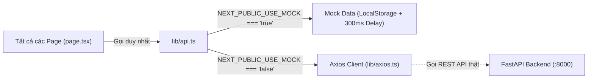

# Artisan Bakery - Hệ Thống Quản Lý Đơn Hàng Tiệm Bánh (Frontend SaaS)

> **Dự án Frontend Web Application** phục vụ quản lý bán lẻ tại quầy (POS), quản lý danh mục kho bánh, theo dõi lịch sử đơn hàng và báo cáo doanh thu dành riêng cho các mô hình tiệm bánh thủ công vừa và nhỏ (Artisan Bakery).

---

## 🌟 Giới Thiệu Dự Án

**Artisan Bakery SaaS** được thiết kế nhằm tối ưu hóa năng suất vận hành của tiệm bánh:
- **Tốc độ bán lẻ cao tại quầy POS**: Giao diện chia 2 cột chuẩn mực (65% menu chọn món / 35% giỏ hàng), hỗ trợ thanh toán đa kênh (QR Pay, Tiền mặt, Thẻ) và tự động trừ tồn kho theo thời gian thực.
- **Quản lý kho & thực đơn**: Bảng danh sách trực quan, phân ngưỡng cảnh báo sắp hết hàng và form thêm/sửa sản phẩm kèm xem trước thẻ bánh (Live Card Preview).
- **Báo cáo kinh doanh thời gian thực**: Trực quan hóa doanh thu theo từng khung giờ trong ngày và bảng xếp hạng Top 5 sản phẩm bán chạy nhất.
- **Phân quyền người dùng (RBAC)**: Tách bạch rõ ràng giữa quyền Quản trị viên (Admin) và Nhân viên Thu ngân (Staff).

---

## 🛠️ Công Nghệ Sử Dụng (Tech Stack)

| Công nghệ / Thư viện | Phiên bản | Vai trò & Mục đích sử dụng |
| :--- | :--- | :--- |
| **Next.js (App Router)** | `15+ / 16.3.1` | Framework React chính, Server Components, tối ưu hóa Routing và Fonts |
| **TypeScript** | `5.x` | Định kiểu dữ liệu tĩnh chặt chẽ, an toàn cho toàn bộ luồng nghiệp vụ |
| **Ant Design** | `v6 / v5-patch` | Thư viện UI Component chính thức (Button, Table, Form, Modal, Select, Tag...) |
| **Tailwind CSS** | `v4` | Quản lý layout, flexbox, grid system và khoảng cách (spacing scale) |
| **Recharts** | `3.x` | Vẽ biểu đồ diện tích (AreaChart) phân bổ doanh thu theo khung giờ tại Dashboard |
| **Axios** | `1.19.x` | HTTP Client gọi API backend kèm Request/Response Interceptor |
| **Google Fonts** | `next/font` | `Be Vietnam Pro` (UI tiếng Việt mượt mà) & `Inter` (Số liệu tài chính) |

---

## 📂 Cấu Trúc Thư Mục Dự Án

```text
.
├── .env.local                    # Biến môi trường cấu hình Mock Data & API URL
├── DESIGN.md                     # Tài liệu Design Tokens & Specs trích xuất từ Google Stitch
├── README.md                     # Hướng dẫn dự án & kiến trúc hệ thống
│
├── BA/                           # 📑 THƯ MỤC TÀI LIỆU NGHIỆP VỤ (BUSINESS ANALYSIS)
│   ├── 01-dang-nhap-phan-quyen.md
│   ├── 02-quan-ly-danh-muc-san-pham.md
│   ├── 03-ban-hang-pos.md
│   ├── 04-quan-ly-ton-kho.md
│   ├── 05-quan-ly-don-hang.md
│   ├── 06-bao-cao-thong-ke.md
│   ├── 07-quan-ly-ca-ket-ca.md
│   ├── 08-da-chi-nhanh-da-kho.md
│   ├── 09-cau-hinh-he-thong-va-ca-dong.md
│   └── 10-ke-toan-so-quy-thu-chi.md
│
├── lib/                          # TẦNG DỊCH VỤ DÙNG CHUNG (SHARED CORE LAYER)
│   ├── axios.ts                  # Axios instance với interceptor tự động gắn Bearer Token
│   ├── mock-data.ts              # Schema TypeScript & bộ dữ liệu mẫu ban đầu
│   ├── auth.ts                   # Quản lý phiên đăng nhập và kiểm tra quyền hạn (Role)
│   └── api.ts                    # CỔNG API DUY NHẤT (Chuyển đổi Mock <-> FastAPI, delay 300ms)
│
└── app/                          # CÁC TRANG ỨNG DỤNG (MỖI ROUTE LÀ 1 FILE PAGE.TSX DUY NHẤT)
    ├── layout.tsx                # Font Be Vietnam Pro + AntdRegistry Wrapper
    ├── client-layout.tsx         # ConfigProvider Theme Emerald (#10B981) + Topbar phân quyền
    ├── globals.css               # Cấu hình Tokens & CSS variables cho Tailwind v4
    ├── page.tsx                  # Root redirect thông minh theo trạng thái phiên làm việc
    ├── login/page.tsx            # [Route 1] Đăng nhập & nút chọn nhanh tài khoản thử nghiệm
    ├── pos/page.tsx              # [Route 2] Giao diện bán hàng POS 2 cột (65/35), kết ca & in phiếu
    ├── products/
    │   ├── page.tsx              # [Route 3] Bảng quản lý kho bánh, lọc danh mục & trạng thái
    │   ├── new/page.tsx          # [Route 4] Form thêm sản phẩm mới (Live Card Preview)
    │   └── [id]/edit/page.tsx    # [Route 4b] Form chỉnh sửa sản phẩm theo ID
    ├── orders/
    │   ├── page.tsx              # [Route 5] Lịch sử đơn hàng, lọc theo trạng thái & thanh toán
    │   └── [id]/page.tsx         # [Route 6] Chi tiết hóa đơn, bảng kê từng món & in phiếu
    ├── shifts/page.tsx           # [Route 7] Báo cáo ca làm việc & đối soát tiền mặt kết ca
    ├── branches/page.tsx         # [Route 8] Quản lý đa chi nhánh & kiểm soát tồn kho từng kho
    ├── settings/page.tsx         # [Route 9] Cài đặt hệ thống & cấu hình ca làm việc động
    ├── accounting/page.tsx       # [Route 10] Sổ quỹ thu chi, quản lý phiếu thu/chi & lãi lỗ P&L
    ├── dashboard/page.tsx        # [Route 11] Báo cáo doanh thu KPI, biểu đồ Recharts, Top 5 món
    └── users/
        ├── page.tsx              # [Route 12] Quản lý nhân sự & tài khoản
        └── new/page.tsx          # [Route 13] Form tạo tài khoản nhân viên mới
```

---

## 🔄 Cơ Chế Chuyển Đổi Mock Data <-> FastAPI (`NEXT_PUBLIC_USE_MOCK`)

Hệ thống được thiết kế với **Kiến trúc Cổng API tập trung (`lib/api.ts`)**, cho phép phát triển và demo toàn bộ Frontend hoàn chỉnh ngay cả khi Backend FastAPI chưa sẵn sàng.



- **Mặc định (`NEXT_PUBLIC_USE_MOCK=true`)**: 
  - Toàn bộ dữ liệu đọc và ghi thông qua `localStorage` trong trình duyệt.
  - Có giả lập độ trễ mạng ~300ms để kiểm thử loading spinners.
  - **Dữ liệu sống (Stateful)**: Khi tạo đơn ở `/pos`, thêm món ở `/products/new` hoặc tạo nhân sự ở `/users/new`, dữ liệu lập tức cập nhật và đồng bộ sang tất cả các trang khác (F5 không mất dữ liệu).
- **Khi kết nối Backend (`NEXT_PUBLIC_USE_MOCK=false`)**:
  - Chỉ cần đổi biến môi trường trong `.env.local`, toàn bộ hệ thống sẽ tự động gọi REST API thật qua Axios mà **không cần sửa đổi bất kỳ dòng code nào trong các trang**.

---

## 👥 Danh Sách Tài Khoản Thử Nghiệm (Demo Accounts)

Tại màn hình đăng nhập `/login`, bạn có thể bấm trực tiếp vào các nút chọn nhanh tài khoản mẫu:

| Tên đăng nhập | Mật khẩu | Họ và tên | Vai trò (Role) | Phạm vi quyền hạn |
| :--- | :--- | :--- | :--- | :--- |
| **`admin`** | `password123` | Nguyễn Quản Trị | **ADMIN** (Quản lý) | Toàn quyền: Dashboard, POS, Sản phẩm, Đơn hàng, Nhân viên |
| **`staff`** | `password123` | Trần Thị Thu Ngân | **STAFF** (Thu ngân) | Chỉ truy cập: Bán hàng tại quầy (POS) & Lịch sử đơn hàng |
| **`lethuha`** | `password123` | Lê Thu Hà | **STAFF** (Thu ngân) | Chỉ truy cập: Bán hàng tại quầy (POS) & Lịch sử đơn hàng |

---

## 🗺️ Danh Sách Tuyến Đường (Routes)

| Tuyến đường | Mục đích sử dụng | Phân quyền truy cập |
| :--- | :--- | :--- |
| `/login` | Đăng nhập tài khoản, chọn nhanh Admin/Staff | Tất cả (Công khai) |
| `/dashboard` | Thống kê KPI, biểu đồ doanh thu Recharts, Top 5 món bán chạy | Chỉ `ADMIN` |
| `/pos` | Giao diện thu ngân bán hàng, giỏ hàng, thanh toán hóa đơn | `ADMIN` & `STAFF` |
| `/products` | Bảng quản lý kho bánh, tìm kiếm, lọc danh mục, xóa món | Chỉ `ADMIN` |
| `/products/new` | Form thêm sản phẩm mới (Live Card Preview) | Chỉ `ADMIN` |
| `/products/[id]/edit` | Form chỉnh sửa thông tin giá, tồn kho của sản phẩm | Chỉ `ADMIN` |
| `/orders` | Bảng lịch sử đơn hàng, lọc theo ngày/trạng thái/thanh toán | `ADMIN` & `STAFF` |
| `/orders/[id]` | Màn hình xem chi tiết hóa đơn và in phiếu nhiệt | `ADMIN` & `STAFF` |
| `/users` | Bảng quản lý nhân viên và tài khoản truy cập | Chỉ `ADMIN` |
| `/users/new` | Form tạo tài khoản nhân viên mới | Chỉ `ADMIN` |

---

## 📚 Tài Liệu Phân Tích Nghiệp Vụ Chi Tiết (Business Analysis)

Toàn bộ tài liệu nghiệp vụ chi tiết chuẩn Agile (gồm *User Stories*, *Acceptance Criteria Given-When-Then* và *Business Rules*) được lưu trữ trong thư mục [`BA/`](file:///Users/gnuhh/Project/python/fe/BA):

1. 📄 [Module 01: Đăng Nhập & Phân Quyền Người Dùng](file:///Users/gnuhh/Project/python/fe/BA/01-dang-nhap-phan-quyen.md)
2. 📄 [Module 02: Quản Lý Danh Mục & Sản Phẩm](file:///Users/gnuhh/Project/python/fe/BA/02-quan-ly-danh-muc-san-pham.md)
3. 📄 [Module 03: Điểm Bán Hàng Tại Quầy (POS)](file:///Users/gnuhh/Project/python/fe/BA/03-ban-hang-pos.md)
4. 📄 [Module 04: Quản Lý & Tự Động Trừ Tồn Kho](file:///Users/gnuhh/Project/python/fe/BA/04-quan-ly-ton-kho.md)
5. 📄 [Module 05: Quản Lý & Tra Cứu Đơn Hàng](file:///Users/gnuhh/Project/python/fe/BA/05-quan-ly-don-hang.md)
6. 📄 [Module 06: Báo Cáo Doanh Thu & Bảng Điều Khiển](file:///Users/gnuhh/Project/python/fe/BA/06-bao-cao-thong-ke.md)
7. 📄 [Module 07: Quản Lý Nhân Viên & Tài Khoản](file:///Users/gnuhh/Project/python/fe/BA/07-quan-ly-nhan-vien.md)

---

## ⚡ Hướng Dẫn Cài Đặt & Chạy Ứng Dụng

### 1. Yêu cầu môi trường
- **Node.js**: Phiên bản `>= 18.18.0` hoặc `>= 20.x`
- **Package Manager**: `pnpm` (khuyên dùng) hoặc `npm` / `yarn`

### 2. Cài đặt các gói phụ thuộc
```bash
pnpm install
```

### 3. Thiết lập biến môi trường
File `.env.local` đã được tạo sẵn với cấu hình mặc định:
```env
NEXT_PUBLIC_USE_MOCK=true
NEXT_PUBLIC_API_URL=http://localhost:8000/api
```

### 4. Chạy môi trường phát triển (Dev Server)
```bash
pnpm dev
```
Mở trình duyệt tại: [http://localhost:3000](http://localhost:3000) (hoặc cổng được Next.js cấp phát).

### 5. Kiểm tra Build & Lint
```bash
# Kiểm tra định dạng code
pnpm lint

# Build sản phẩm đóng gói
pnpm build
```
